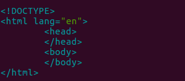
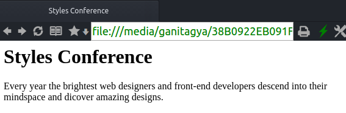

#Webpage Development

##Plain HTML

1. Create an HTML file named "index.html" and save it in a directory named "stylesConference".
2. In this file, add the HTML structure as follows  
	
	

3. Inside the `<head>` element, add `<meta>` and `<title>`. Include proper charset attribute and value in `<meta>`, and title of the page in the
`<title>`.

	

4. Inside the body element, add `<h1>` and `<p>` elements. Include an appropriate heading in the `<h1>`, and a simple paragraph in `<p>`.

	

5. Open the index.html file in a browser by double- clicking it.

	

##CSS Styling

1. Create a directory named "assets" within the Root directory to store styles, images, videos etc. Create a "style" directory within the "assets"
directory.
2. In a text editor, create a file named "style.css" and save it in the "style" directory.
3. From the `index.html` seen in the browser, it is clear that `<h1>` and `<p>` elements have default CSS styles. Using [Eric Meyer's reset](https://github.com/CodeDaitya/HTML-CSS/blob/master/cssBasic.md#css-reset)
we can remove a these styles so that they can all be styled from the same base.

```css
/* http://meyerweb.com/eric/tools/css/reset/ 2. v2.0 | 20110126
  License: none (public domain)
*/

html, body, div, span, applet, object, iframe,
h1, h2, h3, h4, h5, h6, p, blockquote, pre,
a, abbr, acronym, address, big, cite, code,
del, dfn, em, img, ins, kbd, q, s, samp,
small, strike, strong, sub, sup, tt, var,
b, u, i, center,
dl, dt, dd, ol, ul, li,
fieldset, form, label, legend,
table, caption, tbody, tfoot, thead, tr, th, td,
article, aside, canvas, details, embed,
figure, figcaption, footer, header, hgroup,
menu, nav, output, ruby, section, summary,
time, mark, audio, video {
  margin: 0;
  padding: 0;
  border: 0;
  font-size: 100%;
  font: inherit;
  vertical-align: baseline;
}
/* HTML5 display-role reset for older browsers */
article, aside, details, figcaption, figure,
footer, header, hgroup, menu, nav, section {
  display: block;
}
body {
  line-height: 1;
}
ol, ul {
  list-style: none;
}
blockquote, q {
  quotes: none;
}
blockquote:before, blockquote:after,
q:before, q:after {
  content: '';
  content: none;
}
table {
  border-collapse: collapse;
  border-spacing: 0;
}
```

4. Now link the `style.css` file with the HTML file. Open `index.html` in a text eidtor and link the CSS file using `<link>` within our `<head>`
element just after `<title>`.
5. Add a `rel` attribute with a value `stylesheet` in the `<link>` elements to specify the relation of the HTML file with the file being linked.
6. Finally, to locate the file in the filesystem, add an `href` attribute in the `<link>` element with value, in this case `assets/style/style.css`.
7. Now we check the `index.html` again in the browser and see what our style file has changed. Double-click the `index.html` to open it in  browser.

	

As it can be seen, all the default styles for the HTML elements, fonts, spacing etc., has been removed.
